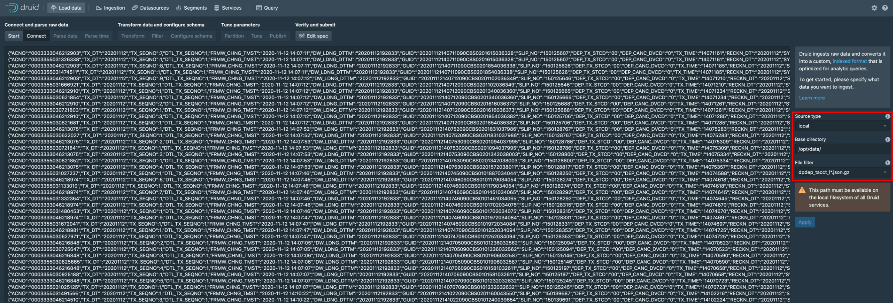

#

## usage

### 1. offload EDW

`st-anl-cmn01` 머신에서 수행 (cmn02 머신에 파이썬 등 인프라 준비가 안됨)

`./ingest.py {table_name} {pk_col_name} {value}`

ex) `./ingest.py {dpdep_tacct_l} {tx_dt} {20201112}`

### 2. copy datafile

`st-anl-cmn02:/docker/druid/volumes/storage/` 경로로 데이터파일 이동

`scp dpdep_tacct_l-20201112.json.gz st-anl-cmn02:/docker/druid/volumes/storage/.`

### 3. load

web console 에서 수행

[Load data] > [Start a new spec] > [Local disk] 메뉴로 진입해서

다음과 같이 해당 데이터파일 패턴 입력

Edit spec 에서 스키마 수정